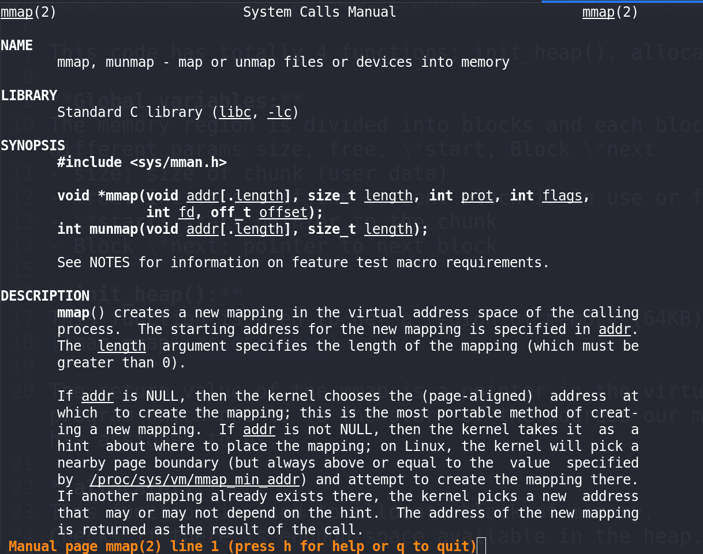
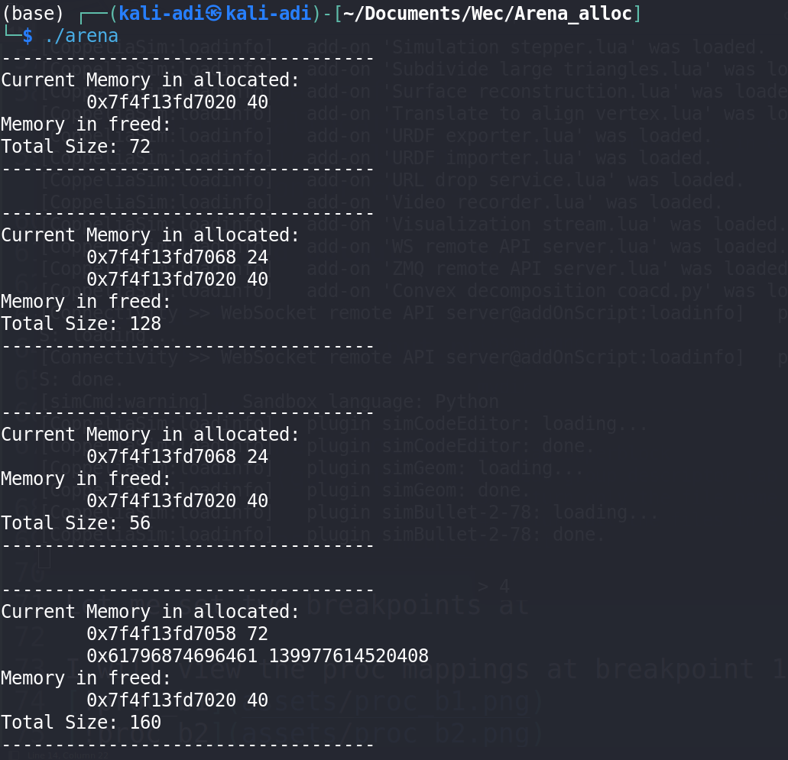
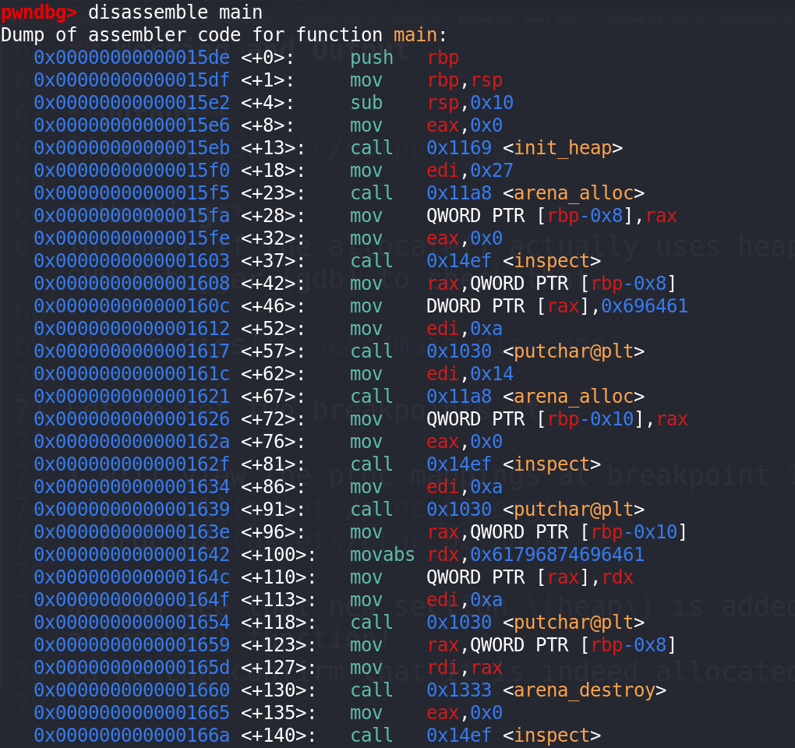
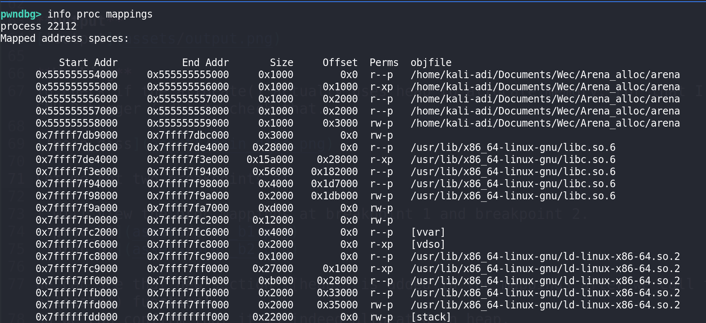
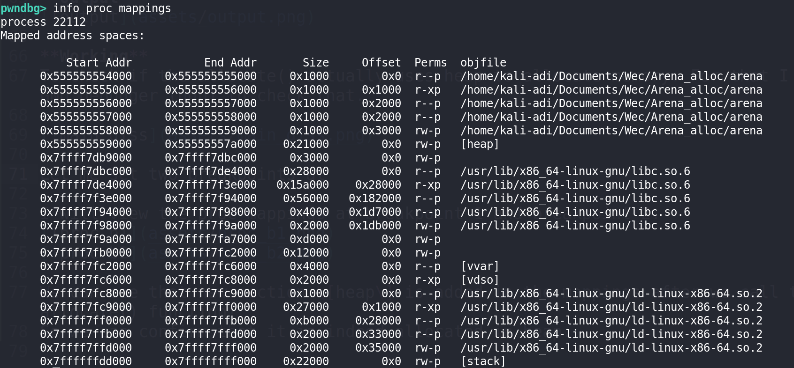

# Arena Allocator

A simple heap based memory allocator in C which replicates malloc,free and realloc functions

## Code Explanation

This code has totally 4 functions; init_heap(), allocate(), destroy(), realloc()

**Global variables:**
The memory region is divided into blocks and each block is a struct with different params size, free, \*start, Block \*next
- size: size of chunk (user data)
- free: int to see if the current block is in use or free
- \*start: start pointer to the chunk
- Block \*next: pointer to next block

**init_heap():**
This function is used to get a region of memory (64KB) using the syscall mmap().

The return value of the mmap is a pointer in the virtual address space of this program which points to the start of the address our memory region which our mmap has assigned to us.

**allocate():**
This function is used to allocate block of memory.
Checks if there is enough space available in the heap.
Attempts to reuse a freed block of sufficient size. If found:
- Marks the block as allocated and removes it from the freed list.
- Adds it to the allocated list and returns the pointer to the start of the user data.

If no suitable freed block is found:
- Allocates a new block from the heap.
- Adds the block to the allocated list.
- Increases the allocated_size accordingly and returns the user data pointer.

**destroy():**
Frees the memory block pointed to by ptr:
- Locates the block in the allocated list.
- Marks the block as free and removes it from the allocated list.
- Adds the block to the freed list and updates the allocated_size.

**reset():**
Reallocates memory for a given pointer to a new size:
- If ptr is NULL, calls arena_alloc() to allocate the new memory.
- If size is 0, calls arena_destroy() to free the memory.
- If the new size is smaller or equal to the current size, returns the existing pointer.
Otherwise:
    - Allocates a new block of memory.
    - Copies the old data to the new memory.
    - Frees the old block and returns the new pointer.

## Memory Management Approach

- Memory Allocation is managed through a linked list, with both allocated and freed blocks tracked separately.
- Attempts to reuse previously freed blocks before allocating new memory.
- Ensures allocations are aligned to BLOCK_SIZE for consistent memory handling.

## Limitations

- The heap size is fixed at 65,536 bytes. If more memory is needed, the program will fail to allocate.
- It is a basic implementation without support for advanced features like memory defragmentation or coalescing freed blocks.

## Working and Output

**Output**

**Working**
To check if the allocate() actually uses heap to allocate memory. For that I used GNU Debugger (gdb) to check that.

Let me set two breakpoints at \*main+8 and \*main+62

I will view the proc mappings at breakpoint 1 and breakpoint 2.

We can see that new section \[heap\] is added in the mappings after we call that allocate() function!
So we can confirm that it is indeed allocated in heap.
